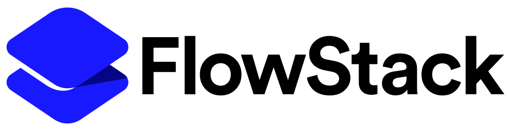

**FlowStack** is a SwiftUI library for creating stack-based navigation with "flow" (aka "zooming") transition animations and interactive pull-to-dismiss gestures. FlowStack's API is modeled after Apple's [NavigationStack](https://developer.apple.com/documentation/swiftui/navigationstack), and though no prior experience with NavigationStack is required to get started with FlowStack, the similarities in use make it easy and intuitive to add FlowStack to a new project or migrate an existing project currently using NavigationStack. An added bonus is that FlowStack is compatible with iOS 15+ where NavigationStack is only available for iOS 16+. (iOS 18 introduced a built-in zoom transition via `navigationTransition(.zoom)`; FlowStack provides similar transitions back to iOS 15, along with interactive pull-to-dismiss and per-link transition customization.)

[](https://github.com/velos/FlowStack/blob/main/LICENSE)


https://github.com/user-attachments/assets/c975bac5-abe7-4283-9d3c-83203cbd37dd

## Installation

To integrate using Apple's Swift package manager, add the following as a dependency to your `Package.swift`:

```swift
.package(url: "https://github.com/velos/FlowStack.git", from: "0.1.0")
```

The full API reference is in the [FlowStack documentation](https://velosmobile.com/FlowStack/documentation/flowstack/).

## Getting started

**Setting up and working with FlowStack is *very* similar to Apple's own NavigationStack:**


For context, here's an example from [Apple's NavigationStack documentation](https://developer.apple.com/documentation/swiftui/navigationstack#overview) showing a basic NavigationStack setup that allows users to navigate to view a detail screen when tapping an item in a list. In this case, the `ParkDetails` transition slides in from the right with the familiar "push" navigation animation.

```swift
NavigationStack {
    List(parks) { park in
        NavigationLink(park.name, value: park)
    }
    .navigationDestination(for: Park.self) { park in
        ParkDetails(park: park)
    }
}
```

**Update the above example to use FlowStack:**

 

1. Add the root view inside the **FlowStack**.
   - For scrolling lists, use a ScrollView with a LazyVStack instead of a List for best animation results.
1. Add a **flowDestination(for:destination:)** modifier within the **FlowStack** hierarchy to associate a data type with its corresponding destination view.
1. Initialize a **FlowLink** with...
   1. A value of the same data type handled by the corresponding **flowDestination(for:destination:)** modifier. 
   1. A **FlowLink.Configuration** to customize aspects of the transition. In the below example, a corner radius value is passed in to the configuration to match the corner radius of the ParkRow during transition.
   1. A view to serve as the content for the **FlowLink**. A common use case would be for this view to contain an image (or other elements) also present in the destination view.
  
In this example, similar to the NavigationStack, when a user selects a given flow link, the park value associated with the link is handled by the corresponding flow destination modifier with matching data type which adds the associated destination view to the stack (in this case, ParkDetails) and presents it via a "zooming" transition animation. Views can be removed from the stack and dismissed programmatically (by calling the **flowDismiss** action from the environment) or by the user dragging down to initiate an interactive dismiss gesture.

```swift
FlowStack {
    ScrollView {
        LazyVStack {
            ForEach(parks) { park in
                FlowLink(value: park, configuration: .init(cornerRadius: cornerRadius)) {
                    ParkRow(park: park, cornerRadius: cornerRadius)
                }
            }
        }
        .padding(.horizontal)
    }
    .flowDestination(for: Park.self) { park in
        ParkDetails(park: park)
    }
}
```

## Navigate to different view types

As with NavigationStack, FlowStack can support different data and view types in the same stack. Simply add a new **flowDestination(for:destination:)** modifier to handle each data type you'd like to support via a given **FlowLink**.

## Dismiss a presented view

By default, any view presented in the flow stack allows the user to drag to interactively dismiss the view. To dismiss a presented view programmatically, simply access the **flowDismiss** object from the environment and call it to dismiss the view.

```swift
// Destination View
@Environment(\.flowDismiss) var flowDismiss
...

Button("Dismiss") {
    flowDismiss()
}
```

To keep the user from dragging a view away, while they have unsaved changes for example, add **flowInteractiveDismissDisabled(_:)** to it. That also keeps a view presented as a card from being dismissed by tapping outside it. Calling **flowDismiss** still dismisses it.

```swift
// Destination View
EditorView(draft: $draft)
    .flowInteractiveDismissDisabled(draft.hasChanges)
```

## Returning to a link

A dismissal zooms back into the flow link wherever it is *now*, not where it was when it was activated. If the layout changed while the destination was presented, because the device rotated or an iPhone Duo was opened or folded, the destination returns to the link's new position and size.

As a destination is dismissed, its link is also scrolled fully into view, without animation, so there is always somewhere visible to return to. That includes bringing it out from under a navigation bar. It never happens while a destination is being presented.

After a layout change a link can end up far outside the visible area, where a lazy container like `LazyVStack` hasn't created it. FlowStack scrolls to the link's row by identity to bring it into existence, and takes the row's identifier to be the `id` of an `Identifiable` value, or else the value itself:

```swift
ForEach(parks) { park in                 // rows identified by park.id ...
    FlowLink(value: park) { ... }        // ... which FlowStack derives from the link's value
}
```

A `ForEach` keyed some other way still works, but a link that isn't on screen can't be scrolled to, and the dismissal zooms to where the link used to be.

Dismiss with **flowDismiss** where you can, rather than by removing from a `FlowPath` yourself. It brings the link into view *before* the dismissal begins, which removing from the path directly can only do after the fact.

## Links that present the same value

More than one flow link can present the same value at once: a product that appears in a row of featured products, say, and again in the list beneath it. A destination zooms out of the link that was activated and back into that same link, and only that link is hidden while the destination is presented. FlowStack works this out for itself.

It needs help only once *every* link presenting the value has been recreated while the destination was presented, which is what a layout change does (a rotation, an iPhone Duo opening, ...), and what a lazy container does to links scrolled far out of view. Nothing then says which of the new links stands where the activated one did. Give the links different identifiers with **flowLinkID(_:)** and they are told apart however they are recreated:

```swift
FeaturedProducts(products)      // FlowLink(value: product) { ... }
    .flowLinkID("featured")
ProductList(products)           // FlowLink(value: product) { ... }
```

The identifier only has to differ between links that present the same value, so it can be given to a single link or, as here, to a whole section at once.

To present a value from a particular link yourself, append it to the flow path with that link's identifier:

```swift
flowPath.append(product, linkID: "featured")
```

Without an identifier, a value appended to the flow path zooms out of the most recently created link that presents it, and every link that presents it is hidden in the meantime.

One thing to watch for: FlowStack brings a link that a lazy container has let go back [by scrolling to its row's identifier](#returning-to-a-link). Two `ForEach`es over the same values in one scroll view give two rows the same identifier, and the scroll view may go to the wrong one. Identify the rows of one of them some other way, as the example app does for its featured products.

## An overlay over the stack

A flow stack can take an `overlay`, a view that stays in front of whatever the stack presents. A flow link in it presents from wherever the stack is, at any depth, and the destination zooms out of and back into the link as usual. That suits a floating button for something like search, or a prompt:

```swift
@State private var path = FlowPath()

FlowStack(path: $path, overlayAlignment: .bottomTrailing) {
    ProductList()
        .flowDestination(for: SearchRequest.self) { _ in
            ProductSearch()
        }
} overlay: {
    if path.isEmpty {                       // only wanted over the root
        FlowLink(value: SearchRequest(), configuration: .init(cornerRadius: 28)) {
            Image(systemName: "magnifyingglass")
                .frame(width: 56, height: 56)
                .glassEffect(.regular.interactive(), in: .circle) // iOS 26 and later
        }
        .padding(20)
        .transition(.opacity)
    }
}
.animation(.easeInOut(duration: 0.2), value: path.isEmpty)
.ignoresSafeArea(.keyboard, edges: .bottom)
```

The link's label can be anything, including Liquid Glass on iOS 26 and later; the example app falls back to a material circle before that. The overlay is laid out within the stack's safe area, so it keeps clear of system UI on every device. The link itself hides while its destination is presented; hiding the whole overlay on `path.isEmpty`, as here, keeps it from floating over other destinations too.

A destination that brings up the keyboard, like a search, wants two more things. FlowStack keeps the destination itself clear of the keyboard (see [Text fields and the keyboard](#text-fields-and-the-keyboard)), but the root view and the overlay are laid out around it like any other view. `.ignoresSafeArea(.keyboard)` on the flow stack, as above, stops them from moving behind the destination as the keyboard comes and goes. And give the field focus as the destination appears and take it back as it is dismissed, so the keyboard comes and goes with the zoom:

```swift
@FocusState private var isSearching: Bool
...
.onAppear { isSearching = true }
.withFlowAnimation(onDismiss: { isSearching = false })
```

## Manage navigation state

By default, a flow stack manages state for any view contained, added or removed from the stack. If you need direct access and control of the state, you can create a binding to a FlowPath and initialize a flow stack with the flow path binding.

```swift
@State var flowPath = FlowPath()
...

FlowStack(path: $flowPath) {
    ScrollView {
        LazyVStack(alignment: .center, spacing: 24, pinnedViews: [], content: {
            ForEach(Product.allProducts) { product in
                FlowLink(value: product, configuration: .init(cornerRadius: cornerRadius)) {
                    ProductRow(product: product, cornerRadius: cornerRadius)
                }
            }
        })
        .padding(.horizontal)
    }
    .flowDestination(for: Product.self) { product in
        ProductDetails(product: product)
    }
}
```

As views are added and removed from the stack, the flow path is updated accordingly. This allows for observation of the flow path if needed as well as the ability to programmatically add and remove items and their associated views from the stack. For example, programmatically presenting a product's details can be done by simply appending the product to the flow path.

```swift
func present(product: Product) {
    flowPath.append(product)
}
```

Views can also be removed programmatically: `flowPath.removeLast()` dismisses the top view, and `flowPath.removeAll()` pops all presented views to return to the root.

## Configure a flow link

A **FlowLink.Configuration** tunes how a link's destination is presented and dismissed. Every option has a default, so pass only the ones you need:

```swift
FlowLink(value: park, configuration: .init(cornerRadius: 24, shadowRadius: 8, shadowColor: .black.opacity(0.2))) {
    ParkRow(park: park)
}
```

| Option | Default | Effect |
|---|---|---|
| `cornerRadius`, `cornerStyle` | `0`, `.circular` | The corners of the destination as it zooms. Match the link's own corners. |
| `shadowRadius`, `shadowColor`, `shadowOffset` | none | The shadow of the destination as it zooms. Match the link's own shadow. |
| `zoomStyle` | `.scaleHorizontally` | `.scaleHorizontally` scales the destination's contents with its frame, so text keeps its line breaks. `.resize` resizes the frame and lays the contents out again at each step. |
| `transitionFromSnapshot` | `true` | Starts the zoom on a snapshot of the link that fades into the destination, and ends the dismissal on one, so the transition begins and ends looking just like the link. |
| `retakeSnapshots` | `false` | Retakes the snapshot every time the link is activated. FlowStack already retakes it when the link's size, value, color scheme or text settings change; use this for a label whose content changes in other ways. |
| `animateFromAnchor` | `true` | Zooms out of the link and back into it. When `false`, the destination slides in from the side instead and the link stays where it is. |
| `swipeUpToDismiss` | `false` | Lets the user dismiss the destination by dragging up as well as down. |
| `showsScrim` | `true` | Dims the flow stack behind the destination. Tapping the scrim dismisses the destination. |
| `presentationStyle` | `.automatic` | Whether the destination fills the flow stack or is presented as a card. See [Presentation style](#presentation-style). |

The duration and bounce of the transitions are set for the whole stack, with **CustomSmoothAnimation**: `FlowStack(customSmoothAnimation: .init(duration: 0.3, bounce: 0.1)) { ... }`.

A flow link lays a button over its label, which shrinks the label slightly while it is pressed. The button also keeps controls inside the label from being tapped, so if the label has controls of its own, activate the link with a tap gesture instead, which they take precedence over:

```swift
FlowLink(value: park, activation: .tapGesture) {
    ParkRow(park: park, onFavorite: { favorite(park) })
}
```

## Presentation style

On iPhone, a destination view fills the flow stack. On iPad, when the flow stack is wide enough, the destination is instead presented as a centered card over the dimmed flow stack. Wide iPhone displays, like an unfolded iPhone Duo or a landscape iPhone Pro Max, present full screen.

To override this for a given link, pass a **FlowPresentationStyle** to its configuration:

```swift
// Always fill the flow stack, even on iPad.
FlowLink(value: video, configuration: .init(cornerRadius: cornerRadius, presentationStyle: .fullScreen)) {
    VideoRow(video: video)
}
```

| Style | Behavior |
|---|---|
| `.automatic` | Full screen on iPhone; a card on other devices when one fits. The default. |
| `.fullScreen` | Always fills the flow stack. |
| `.card` | A card whenever the flow stack is wide enough to fit one, on any device. |

Destinations that extend under system UI should respect the safe area on *every* edge their content touches, not just the top: on iPhone Duo, the camera and status items sit in the trailing corner and are reported as a trailing inset. For controls like a close button, prefer a toolbar item inside a `NavigationStack` in the destination over positioning one by hand; the system places toolbar items clear of system UI on every device.

## Text fields and the keyboard

When the keyboard comes up in a destination that fills the flow stack, the destination stays full size behind the keyboard, as any full-screen view does, and its content keeps clear of the keyboard through its safe area. A destination presented as a card moves up out of the keyboard's way instead, like a form sheet.

So a destination that extends under system UI, like a hero image running up under the status bar, should ignore only the safe area it means to. `.ignoresSafeArea()` ignores the keyboard too, and leaves a text field in the destination behind it:

```swift
ScrollView {
    ParkHeader(park: park)
    ParkDescription(park: park)
}
.safeAreaInset(edge: .bottom) {
    TextField("Add a note", text: $note)
}
.ignoresSafeArea(.container, edges: .top) // not .ignoresSafeArea(), which puts the field behind the keyboard
```

A destination hosted in a `NavigationStack` keeps its content clear of the keyboard either way, since the navigation stack works out its content's safe area for itself.

## Animation anchors


By default, flow transition animations originate from the bounds of the view provided as content to a FlowLink. However, depending on the given UI, it's sometimes preferable for the transition animation to originate from a subview within the FlowLink's content view.

A common use case is when a FlowLink's view contains an image along with additional view elements, but you only want the transition animation to emanate from the image, not the entire view containing the other elements. You can achieve this effect by adding a **.flowAnimationAnchor()** modifier to the view you want the transition animation to emanate from.

The below example adds the **.flowAnimationAnchor()** modifier to the image view. This allows the entire view inside the FlowLink to be tappable while constraining the transition animation to just the image.

```swift
FlowLink(value: park, configuration: .init(cornerRadius: cornerRadius)) {
    HStack {

        image(url: park.imageUrl)
            .clipShape(RoundedRectangle(cornerRadius: cornerRadius, style: .continuous))
            .flowAnimationAnchor() // <- 💡 Sets the given view as the transition origin.

        VStack(alignment: .leading) {
            Text(park.name)
                .font(.title)
            Text(park.cityStateAddress)
                .font(.subheadline)
            Spacer()
        }
        Spacer()
    }
}
```

## Animating views with flow animation

FlowStack provides a default transition animation when presenting a destination view, however sometimes it's desirable to add additional animations to specific view elements within the presented view during the transition; for example, you may want a "close" button or other text to fade in during presentation and fade out when the view is dismissed. To do this, just add a **withFlowAnimation(onPresent:onDismiss:)** modifier to your destination view and update the properties you want to animate respectively in the **onPresent** and **onDismiss** handlers.

```swift
// Destination view
@State var opacity: CGFloat = 0
...

VStack {
    image(url: park.imageUrl)
    
    Text(park.description)
        .opacity(opacity) // <- Opacity for description text
}
.withFlowAnimation {
    opacity = 1 // <- Animates with the flow transition presentation
} onDismiss: {
    opacity = 0 // <- Animates with the flow transition dismissal
}
```

## Image snapshots

When displaying async images within a FlowLink, use [CachedAsyncImage](https://github.com/lorenzofiamingo/swiftui-cached-async-image) instead of SwiftUI's provided [AsyncImage](https://developer.apple.com/documentation/swiftui/asyncimage). AsyncImage does not cache fetched images and as a result, will not load a previously fetched image fast enough to be included in transition snapshots (i.e. when `transitionFromSnapshot: true` in FlowLink Configuration). FlowStack itself has no dependencies, so add CachedAsyncImage to your project separately:

```swift
.package(url: "https://github.com/lorenzofiamingo/swiftui-cached-async-image.git", from: "2.1.0")
```

[CachedAsyncImage docs](https://github.com/lorenzofiamingo/swiftui-cached-async-image) has a similar API to AsyncImage with the added ability to specify a cache for caching images. Setting a larger custom cache size is often necessary to get images to actually be cached; images must not be larger than 5% of the disk cache. [See discussion](https://developer.apple.com/documentation/foundation/nsurlsessiondatadelegate/1411612-urlsession#discussion)

```swift
// Custom cache to support larger image caching
extension URLCache {
    static let imageCache = URLCache(memoryCapacity: 512_000_000, diskCapacity: 10_000_000_000)
}

...

// Usage
CachedAsyncImage(url: url, urlCache: .imageCache) { image in
    image
        .resizable()
        .scaledToFill()
        .frame(minWidth: 0, maxWidth: .infinity, minHeight: 0, maxHeight: .infinity)
} placeholder: {
    Color(uiColor: .secondarySystemFill)
}
```
